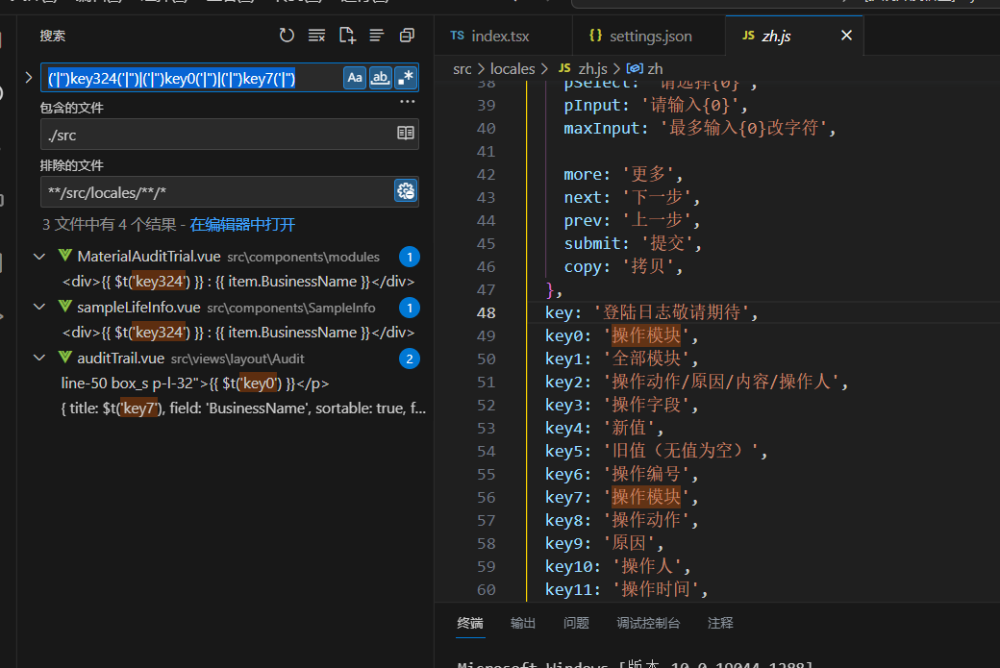
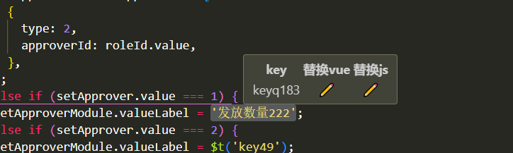

# search-i18n

根据文本去匹配 i18 的 key 搜索对应的文件

# 使用方法

1. 配置 setting.json

   ```json
   {
     "i18n-ally.localesPaths": ["src/locales"], // 语言包目录
     "search-i18n": {
       "entry": "zh.js", // 查询插件中文文件
       "incldesFile": "ts,tsx,vue" // 匹配文件 默认: ts,tsx,vue
     }
   }
   ```

2. 运行任务(ctrl+shift+p)
3. 搜索 searchi18n
4. 输入搜索内容，点击回车。
5. 插件会查询到所有匹配的内容，然后执行搜索功能。
   
6. 选中中文时可以自动替换成对应的key
   

## LICENSE

MIT

